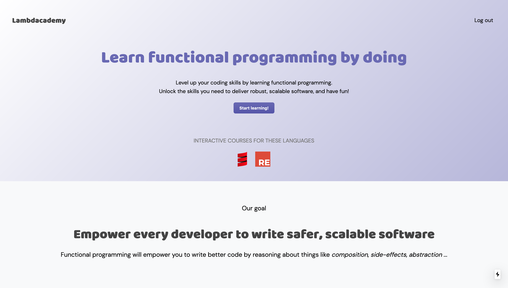
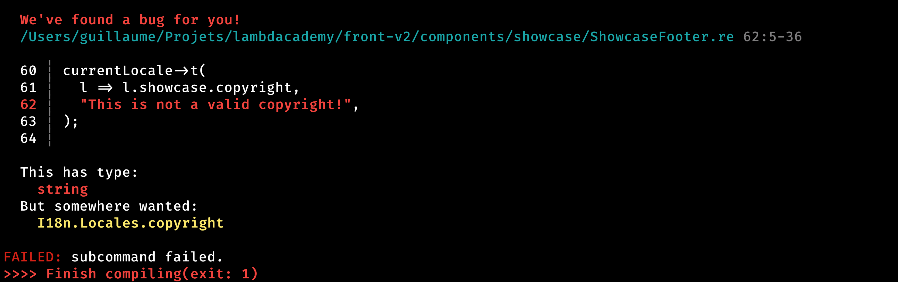
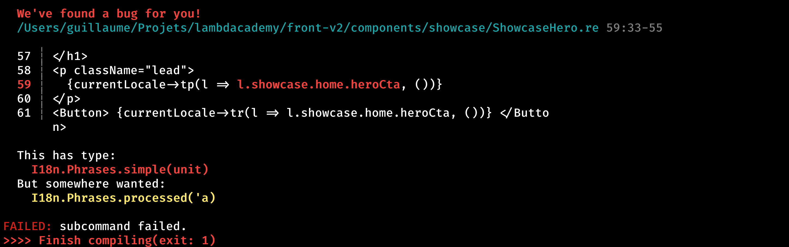

<!-- _class: invert -->
<!--footer: Guillaume Bogard - guillaumebogard.dev -->

# Type-safe internationalization with ReasonML

### @bogardguillaume - guillaumebogard.dev

---

# Hello there!

My name is **Guillaume Bogard**, I'm a Scala developer [@Linkvalue](https://link-value.fr/fr).

I ❤️ functional programming and teach it through blog posts, talks, and on-site training.

My hobbies include going to the movies, playing strategy games and riding roller coasters.

---

# What is ReasonML?

---

- **ReasonML is not a completely new language**, it's a JavaScript-inspired syntax for Ocaml 🐫
- Thanks to **BuckleScript**, it can be compiled to Javascript, and ran in the browser
- Bucklescript makes interop with Javascript super easy with 
  - easy bindings from Javascript to ReasonML
  - very clean output from ReasonML to Javascript
- **ReasonReact** is the official React binding for ReasonML
  - It has a similar API to the JS version of React
  - It has 100% feature parity

---

# Why ReasonML?

- It's **fast**:
  - Blazing fast compile times
  - Clean output for optimized runtime speed
- It's **convenient**:
  - Pattern matching
  - Flawless type inference
  - Curried functions as standard
  - Argument piping
- It's **safe**:
  - Lots of compile-time checks, including exhaustivity of pattern matching

---

> I see ReasonML as a way to unlock a much more ambitious future
for UI development.

Jordan Walke, creator of React and ReasonML, [React to the future](https://www.youtube.com/watch?v=5fG_lyNuEAw)

---

<!-- _class: invert -->



# Use case

- I have an app called **Lambdacademy** that provides interactive courses for Scala and ReasonML in the browser (very early-stage work 👶)
- It's built with ReasonML and Next.js
- I want to translate in many languages

---

# Goals

- Translation keys should be type-safe : i.e., Invalid key references
are caught at compile time
- Translation *substitutions* (variable interpolations) should be type-safe: i.e., I can't provide a wrong substitution for a key
- I want Markdown formatting (or any other type of formatting) in some of my keys
- Formatting should be type-safe: i.e., I can't mix a plain text key
with a markdown key

---

# More goals

- API should be nice to use
- Implementation should be straightforward

---


## Step one

# Type-safe from keys to translations 

---

I'm modeling locales as nested *records*, and then casting a JS module
to the Reason type.

```reasonml
module Locales = {
  type commons = {
   logIn: string
  };

  type t = {
    commons: commons,
    hello: string,
  };

  [@bs.module "./en.json"] external english: t = "default";
};
```

---

Then I store the current locale in a Context

```reasonml
type localeId = [ | `en | `fr];

type i18nContext = {
  currentLocaleId: localeId,
  setCurrentLocaleId: localeId => unit,
  currentLocale: Locales.t,
};

module Provider = {
  let context =
    React.createContext({
      currentLocaleId: `en,
      setCurrentLocaleId: _ => (),
      currentLocale: Locales.english,
    });

  [@react.component]
  let make = (~children) => {
    let (currentLocaleId, setCurrentLocaleId) = React.useState(() => `en);

    let contextValue: i18nContext = {
      currentLocaleId,
      setCurrentLocaleId: id => setCurrentLocaleId(_ => id),
      currentLocale:
        switch (currentLocaleId) {
        | `fr => Locales.english
        | `en => Locales.english
        },
    };

    React.createElement(
      context->React.Context.provider,
      {"value": contextValue, "children": children},
    );
  };
};

let useI18n = () => React.useContext(Provider.context);
```

---

Finally, I create a simple binding for the polyglot library.

```reasonml
module Polyglot = {
  [@bs.module "node-polyglot"] external transformPhrase: string => string = "transformPhrase";
};

let t = (locale, selector: Locales.t => string) => locale->selector->Polyglot.transformPhrase;
```

<br />

Usage is as simple as

```reasonml
[@react.component]
let make = () => {
  let {currentLocale} = useI18n();
  let message = currentLocale->t(l => l.hello)->React.string;

  <h1>{message}</h1>
}
```

---

## Step two

# Type-safe substitutions using phantom types

---

I will use a phantom type to bind *phrases* to their appropriate *substitutions*.

```reasonml
module type Phrases = {
  type t('substitution);
  let toString: t('s) => string;
};

module Phrases: Phrases = {
  type t('substitutions) = string;
  let toString = this => this;
};
```

---

Then I need to change the model for my locales

```reasonml
module Locales = {
  type commons = {
   logIn: Phrases.t(unit)
  };

  type t = {
    commons: commons,
    hello: Phrases.t(string),
  };

  [@bs.module "./en.json"] external english: t = "default";
};
```

There's no need to change the JSON file because phrases are still plain strings at runtime.

---

The translate functions changes very slightly

```reasonml
let t = (locale, selector: Locales.t => Phrases.simple('s), substitutions: 's) =>
  locale->selector->Phrases.toString->Polyglot.transformPhrase(substitutions);
```

<br />

Usage it just as simple

```reasonml
[@react.component]
let make = () => {
  let {currentLocale} = useI18n();
  let message = currentLocale->t(l => l.hello, "World")->React.string;

  // Hello World!
  <h1>{message}</h1>
}
```

---

Now, the compiler won't let me forget a substitution, or match a phrase with a wrong type of substitution 🥳



It even has a nice colored output 🎨

---

## Step three

# Type-safe formatting

---

I use multiple types to distinguish between *simple* phrases and *processed* phrases i.e, phrases that have some sort of formatting to them.

```reasonml
module type Phrases = {
  type simple('substitution);
  type processed('substitution);

  let toString: simple('s) => string;
  let toStringP: processed('s) => string;
};

module Phrases: Phrases = {
  type simple('substitutions) = string;
  type processed('substitutions) = string;
  let toString = this => this;
  let toStringP = this => this;
};
```

---

And then I just to create a function to translate *processed phrases*.

```reasonml
let t = (locale, selector: Locales.t => Phrases.simple('s), substitutions: 's) =>
  locale->selector->Phrases.toString->Polyglot.transformPhrase(substitutions);

let tp =
    (locale, selector: Locales.t => Phrases.processed('s), substitutions: 's) =>
  locale
  ->selector
  ->Phrases.toStringP
  ->Polyglot.transformPhrase(substitutions)
  ->(
      str =>
        <div
          dangerouslySetInnerHTML={"__html": Marked.renderAndSanitize(str)}
        />
    );
```

(I have created a binding for *Marker* earlier)

---

The `tr` functions is automatically passing my phrase to *Marker* and rendering a React component, so usage is as simple as:

```reasonml
[@react.component]
let make = () => {
  let {currentLocale} = useI18n();

  <div id="hero" className=heroStyle>
    <ShowcaseNavbar />
    <div className=topStyle>
      <p className="lead">
        {currentLocale->tp(l => l.showcase.home.heroText, ())}
      </p>
    </div>
  </div>;
};
```

---

And once again, the compiler won't let be wrong



---

## Next steps?

- Get rid of Polyglot️️ ➡️ smaller bundles
- Improve the formatting system ➡️ more versatility
- Publish it as an independent library 🎉

---

<!-- _class: invert -->
# Thank you!

## This talk is on GitHub: gbogard/reasonml-i18n-talk